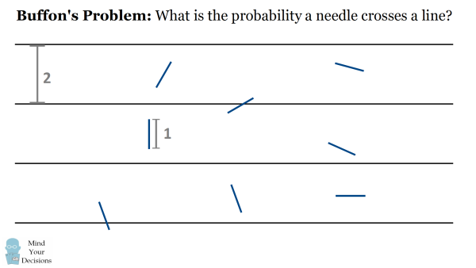

# Buffon's Needle README

If you were to randomly drop needles onto a plane with parallel lines spaced a distance of 2 needles apart, the total number of needles over those that intersect a line approaches $\pi$???
Mysterious? I think not.

This is a small project to learn and practice fascinating (geometric) probability theory, specifically Monte Carlo simulations.

---

## Here is the Math Explained

Let’s say the needle has length $\ell$.

- For intersection, we care about the position $x$ of the needle’s center and the angle $\theta$.
- The probability density of the center of the match is  
  $P_x = \frac{1}{\ell}$
- The probability density of the angle is  
  $P_\theta = \frac{2}{\pi}$
- The probability for the match to cross a line is given by the double integral  
  $P = \iint \bigl(P_x \,P_\theta\bigr)\,dx\,d\theta$
- The condition for the match to cross the line is  
  $x < \frac{\ell}{2}\,\sin(\theta)$
- Therefore, the $x$ integration bounds are from $0$ to $\frac{\ell}{2}\,\sin(\theta)$, and the $\theta$ integration goes from $0$ to $\frac{\pi}{2}$.

Following through with these integrals, we get:
\[
P \;=\; \int_{\theta=0}^{\frac{\pi}{2}} \int_{x=0}^{\frac{\ell}{2}\sin(\theta)} \left( \frac{1}{\ell} \times \frac{2}{\pi} \right)\,dx\,d\theta \;=\; \frac{1}{\pi}.
\]

Going back to the problem, if you drop $N_{\text{tot}}$ total needles, we expect approximately
\[
N_{\text{cross}} \;=\; N_{\text{tot}} \times \frac{1}{\pi}
\]
needles to cross a line. Rearranging this, we get
\[
\frac{N_{\text{tot}}}{N_{\text{cross}}} \;\approx\; \pi.
\]
As $N_{\text{tot}}$ becomes very large, this ratio converges to $\pi$ (by the Law of Large Numbers), making it a neat way to estimate $\pi$ empirically.
