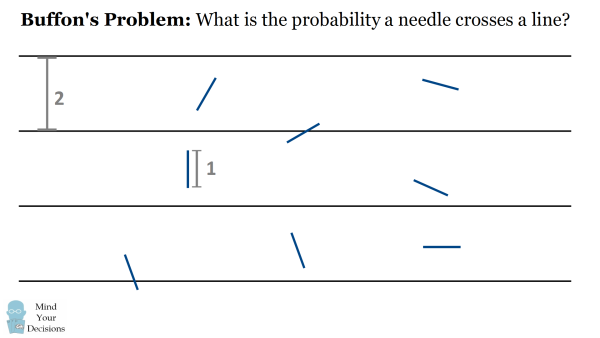

# Buffon's Needle README

If you randomly drop needles onto a plane with parallel lines spaced a distance of 2 needles apart, the total number of needles over those that intersect a line approaches $\pi$???
Mysterious, huh? Let's see what's going on!

This is a small project to learn and practice fascinating (geometric) probability theory, specifically Monte Carlo simulations.

---

## Here is the Math Explained

Let’s say the needle has length $\ell$.

- For intersection, we care about the position $y$ (for horiziontal lines) of the needle’s center and the angle $\theta$.
- The probability density of the center of the needle is  
  $P_y = \frac{1}{\ell}$
- The probability density of the angle is  
  $P_\theta = \frac{2}{\pi}$
- The probability for the needle to cross a line is given by the double integral  
  $P = \iint \bigl(P_y \,P_\theta\bigr)\,dy\,d\theta$
- The condition for the needle to cross the line is  
  $y < \frac{\ell}{2}\sin(\theta)$
- Therefore, the $y$ integration bounds are from $0$ to $\frac{\ell}{2}\sin(\theta)$, and the $\theta$ integration goes from $0$ to $\frac{\pi}{2}$.

Following through with these integrals, we get:

$$
P =
\int_{0}^{\pi/2}
\int_{0}^{(\ell/2)\sin(\theta)}
\left(\frac{1}{\ell} \cdot \frac{2}{\pi}\right)
\,dy\,d\theta
$$

First, combine the constants:

$$
P =
\int_{0}^{\pi/2}
\int_{0}^{(\ell/2)\sin(\theta)}
\frac{2}{\pi \ell}
\,dy\,d\theta
$$

Now evaluate the inside integral with respect to $y$:

$$
P =
\int_{0}^{\pi/2}
\frac{2}{\pi \ell}
\left[
y
\right]_{0}^{(\ell/2)\sin(\theta)}
d\theta
$$

Plug in the bounds for $y$:

$$
P =
\int_{0}^{\pi/2}
\frac{2}{\pi \ell}
\left(
\frac{\ell}{2}\sin(\theta) - 0
\right)
d\theta
$$

Simplify:

$$
P =
\int_{0}^{\pi/2}
\frac{1}{\pi}\sin(\theta)
\,d\theta
$$

Pull out the constant:

$$
P =
\frac{1}{\pi}
\int_{0}^{\pi/2}
\sin(\theta)
\,d\theta
$$

Now integrate:

$$
P =
\frac{1}{\pi}
\left[
-\cos(\theta)
\right]_{0}^{\pi/2}
$$

Evaluate the bounds:

$$
P =
\frac{1}{\pi}
\left(
-\cos(\pi/2) + \cos(0)
\right)
$$

Since $\cos(\pi/2)=0$ and $\cos(0)=1$,

$P =\frac{1}{\pi}(1)=\frac{1}{\pi}$

Going back to the problem, if you drop $N_{\text{tot}}$ total needles, we expect approximately
$N_{\text{cross}} \=\ N_{\text{tot}} \times \frac{1}{\pi}$
needles to cross a line. Rearranging this, we get
$\frac{N_{\text{tot}}}{N_{\text{cross}}} \\approx\ \pi$
As $N_{\text{tot}}$ becomes very large, this ratio converges to $\pi$ (by the Law of Large Numbers), making it a neat way to estimate $\pi$ empirically.

---

## How Fast Does It Approach $\pi$?

The estimate approaches $\pi$, but it does so slowly because this is a Monte Carlo simulation.

Each needle drop is like a random trial:

- it crosses a line, or
- it does not cross a line.

The true probability of crossing is

$$
p = \frac{1}{\pi}
$$

So if we drop $N_{\text{tot}}$ needles, then the number of crossing needles is approximately

$$
N_{\text{cross}} \sim \text{Binomial}\left(N_{\text{tot}}, \frac{1}{\pi}\right)
$$

The observed crossing probability is

$$
\hat{p}
=
\frac{N_{\text{cross}}}{N_{\text{tot}}}
$$

Since the true crossing probability is $p = 1/\pi$, we estimate $\pi$ by flipping this fraction:

$$
\hat{\pi}
=
\frac{1}{\hat{p}}
=
\frac{N_{\text{tot}}}{N_{\text{cross}}}
$$

The important question is: how quickly does $\hat{\pi}$ get close to $\pi$?

For a binomial random variable, the sample proportion $\hat{p}$ has standard error

$$
\text{SE}(\hat{p})
=
\sqrt{\frac{p(1-p)}{N_{\text{tot}}}}
$$

This means the error in $\hat{p}$ shrinks like

$$
\frac{1}{\sqrt{N_{\text{tot}}}}
$$

But our estimate is not $\hat{p}$ directly. Our estimate is

$$
\hat{\pi}
=
\frac{1}{\hat{p}}
$$

So we look at the function

$$
f(p) = \frac{1}{p}
$$

Its derivative is

$$
f'(p) = -\frac{1}{p^2}
$$

This derivative tells us how much small errors in $\hat{p}$ get magnified when we convert $\hat{p}$ into $\hat{\pi}$.

Since

$$
p = \frac{1}{\pi}
$$

we get

$$
f'(p)
=
-\frac{1}{(1/\pi)^2}
=
-\pi^2
$$

So small errors in the crossing probability are magnified by about $\pi^2$ when estimating $\pi$.

Using this derivative approximation,

$$
\text{SE}(\hat{\pi})
\approx
\pi^2
\sqrt{
\frac{
(1/\pi)(1 - 1/\pi)
}{
N_{\text{tot}}
}
}
$$

This simplifies to the form

$$
\text{SE}(\hat{\pi})
\approx
\frac{C}{\sqrt{N_{\text{tot}}}}
$$

where $C$ is a constant. The key point is that the error still shrinks like

$$
\frac{1}{\sqrt{N_{\text{tot}}}}
$$

So Buffon's Needle converges at the usual Monte Carlo rate:

$$
\text{error}
=
O\left(\frac{1}{\sqrt{N_{\text{tot}}}}\right)
$$

This is a slow convergence rate. To make the error about 10 times smaller, we need about 100 times more needle drops.

For example:

- 100 drops gives a rough estimate
- 10,000 drops gives a better estimate
- 1,000,000 drops gives a much better estimate, but still has random noise

So the simulation does approach $\pi$, but it approaches slowly because randomness only averages out at a rate proportional to $1/\sqrt{N_{\text{tot}}}$.
